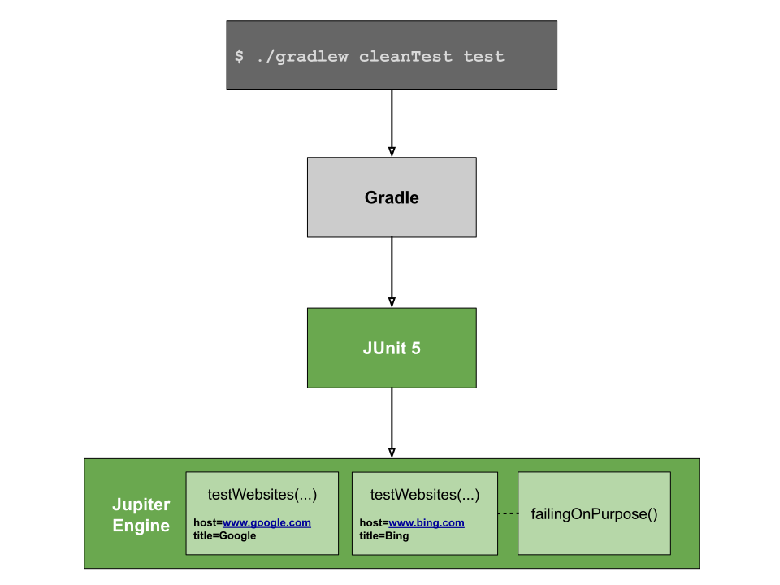
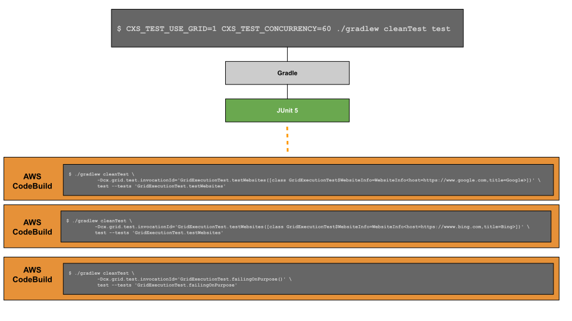
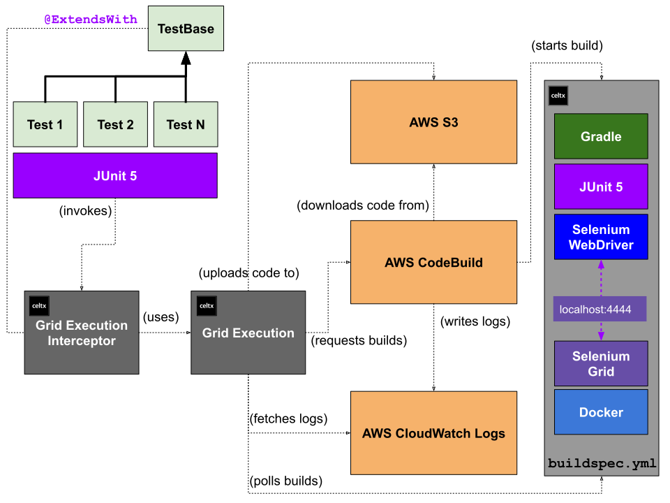
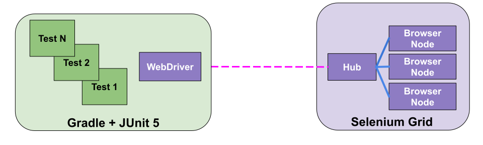
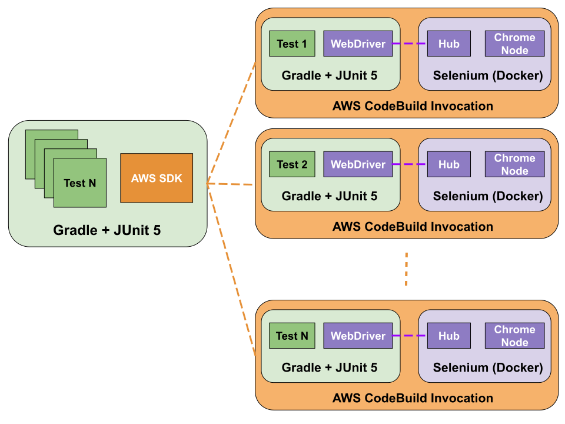
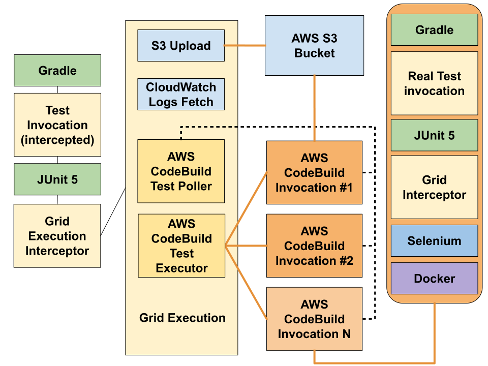

# High concurrency test execution with fully independent test execution environments

## INTRODUCTION

We have developed a method for running JUnit 5 tests in a cloud-based execution environment
having the desired features of high concurrency, per-test separate execution environments, and
minimal disruption to existing test source code.

To make it easier to refer to, let's call this new test execution method _HCS Grid_, since its main
goals are high concurrency and per-test execution environment separation.

## MOTIVATION

At Celtx, before each production deployment, we run many hundreds of selenium tests.  We
are also constantly adding more and more selenium tests as we discover new bugs and add
new features.

In the past few months, our total test execution time for selenium tests was starting to
approach **four hours**.

We have also noticed that as the number of selenium tests grew, that the overall
stability of the testing grid seemed to be affected.  In particular, we started to see
more and more occurrences of `UnreachableBrowserException`, and other similar errors,
which indicated to us that our test execution results were becomingly increasingly
non-deterministic.

## TL;DR

If you already use Gradle and JUnit 5 for your Selenium tests, this HCS Grid requires very 
little disruption to your code and Gradle configuration.

Indeed, if you wish to use it in your own code, you simply need to add our JUnit 5 test
invocation interceptor to your test class (or base class) similar to:

```java
  @ExtendWith(cx.selenium.GridExecutionInterceptor.class)
  class MyTestClass {
  }
```

You may then run your tests normally as if the interceptor didn't exist via:

```shell
$ ./gradlew cleanTest test
```

You may run your tests with the HCS Grid via (assuming prequisites are met):

```shell
$ CXS_TEST_USE_GRID=1 CXS_TEST_CONCURRENCY=60 ./gradlew cleanTest test
```

## PREREQUISITES

In order to use this code, your own test execution environment will need to satisfy the following
prerequisites:

1. JUnit v5.6.0 or later
1. Gradle build system
1. AWS S3 bucket for use during test execution
1. AWS CloudWatch Logs log group for AWS CodeBuild build output
1. properly configured AWS IAM service role for use by AWS CodeBuild
1. sufficient privileges for the IAM user that will be used when executing the tests
1. AWS SDK credentials/configuration for IAM user and region, e.g. `$HOME/.aws/credentials` and `$HOME/.aws/config`

The HCS Grid depends on the [AWS CodeBuild](https://aws.amazon.com/codebuild/) service.
This service requires an IAM service role.  That requirement, and others are listed in 
the [CODEBUILD](docs/CODEBUILD.md) document.

*Note:* that when we run tests using the HCS Grid, it is imperative that JUnit 5
parallel mode is enabled.  In this sample code, we accomplish by using a
sourceSets section of the [build.gradle](build.gradle) file.

# OVERVIEW

Roughly speaking, this HCS Grid will transform a test execution environment like:



so that it executes each test in its own AWS CodeBuild request, so that the above
execution environment will now look like:



Each JUnit 5 test executed will cause a new AWS CodeBuild request to be made, each request with its
own custom [buildspec.yml](https://docs.aws.amazon.com/codebuild/latest/userguide/build-spec-ref.html) as shown below.
  
This AWS CodeBuild buildspec sets up a Docker-based selenium grid per test.

This example buildspec also hints at how this test execution method handles parameterized tests
(note the occurrence of `-Dcx.grid.test.invocationId=<param.toString()>` in the Gradle wrapper command).

```yaml
version: 0.2
env:
  variables:
    TESTHOST: localhost
    BROWSER: chrome
    GRADLE_USER_HOME: .gradle/userHome
phases:
  install:
    runtime-versions:
      java: corretto11
  pre_build:
    commands:
      - export LC_ALL="en_US.utf8"
      - echo $PATH
      - java -version
      - echo $HOME 
      - echo "Testing repo"
      - pwd
      - ls -al
      - docker-compose --no-ansi up --detach
      - chmod u+x ./gradlew
      - ./gradlew -v
      - sleep 5
  build:
    commands:
      -  ./gradlew cleanTest -Dcx.grid.test.invocationId='GridExecutionTest.testWebsites([class GridExecutionTest$WebsiteInfo=WebsiteInfo<host=https://www.google.com,title=Google>])' test --tests 'GridExecutionTest.testWebsites'
  post_build:
    commands:
      - echo "Post build cleanup"
      - docker-compose --no-ansi down --remove-orphans
cache:
  paths:
  - '.gradle/**/*'
```

Every test will get expanded into its own AWS CodeBuild request, this is true, even for
parameterized tests.

Compare the PASSED/SKIPPED entries to the `-Dcx.grid.test.invocationId=` argument in the
two AWS CodeBuild Log Outputs shown below for a glimpse into how this works.

### AWS CodeBuild Log Output 1
```shell
... snip snip
[Container] 2020/03/20 15:52:19 Entering phase BUILD
[Container] 2020/03/20 15:52:19 Running command ./gradlew cleanTest -Dcx.grid.test.invocationId='GridExecutionTest.testWebsites([class GridExecutionTest$WebsiteInfo=WebsiteInfo<host=https://www.google.com,title=Google>])' test --tests 'GridExecutionTest.testWebsites'
To honour the JVM settings for this build a new JVM will be forked. Please consider using the daemon: https://docs.gradle.org/6.2.2/userguide/gradle_daemon.html.
... snip snip
GridExecutionTest > Test Website WebsiteInfo<host=https://www.google.com,title=Google> PASSED

GridExecutionTest > Test Website WebsiteInfo<host=https://wwww.bing.com,title=Bing> SKIPPED

BUILD SUCCESSFUL in 22s
4 actionable tasks: 3 executed, 1 up-to-date

[Container] 2020/03/20 15:52:42 Phase complete: BUILD State: SUCCEEDED
... snip snip
```

### AWS CodeBuild Log Output 2
```shell
... snip snip
[Container] 2020/03/20 15:52:13 Entering phase BUILD
[Container] 2020/03/20 15:52:13 Running command ./gradlew cleanTest -Dcx.grid.test.invocationId='GridExecutionTest.testWebsites([class GridExecutionTest$WebsiteInfo=WebsiteInfo<host=https://wwww.bing.com,title=Bing>])' test --tests 'GridExecutionTest.testWebsites'
To honour the JVM settings for this build a new JVM will be forked. Please consider using the daemon: https://docs.gradle.org/6.2.2/userguide/gradle_daemon.html.
... snip snip
GridExecutionTest > Test Website WebsiteInfo<host=https://www.google.com,title=Google> SKIPPED

GridExecutionTest > Test Website WebsiteInfo<host=https://wwww.bing.com,title=Bing> PASSED

BUILD SUCCESSFUL in 22s
4 actionable tasks: 3 executed, 1 up-to-date

[Container] 2020/03/20 15:52:36 Phase complete: BUILD State: SUCCEEDED
... snip snip
```

While this test execution method is not limited to Selenium testing, that is what this
test execution environment was built for.

## Quick Start

In order to use this code, you'll need to satisfy the prerequisites enumerated in [CODEBUILD](docs/CODEBUILD.md)

You'll also need to tell the test execution environment about your AWS CodeBuild configuration by
setting several environment variables, in particular:

1. `CXS_TEST_USE_GRID` (set to 1)
1. `CXS_TEST_CONCURRENCY` (set it to 60, default AWS CodeBuild supports 60 maximum simultaneous builds)
1. `CXS_TEST_CODEBUILD_LOG_GROUP` (up to you, e.g. _codebuild_)
1. `CXS_TEST_CODEBUILD_ARN` (copy/paste from [AWS Console](https://console.aws.amazon.com/iam/home?region=us-east-1#/roles/CodeBuildServiceRole))
1. `CXS_TEST_CODEBUILD_S3`(just the bucket name, excluding s3:// and excluding domain name)

You may need to set your region via `AWS_REGION` (depending on your AWS SDK configuration).

Once you have done that, you'll be able to run the provided sample test to verify your configuration by
running the command below:

```shell

AWS_REGION=us-east-1 \
CXS_TEST_USE_GRID=1 \
CXS_TEST_CONCURRENCY=60 \
CXS_TEST_CODEBUILD_S3=<your s3 codebuild bucket> \
CXS_TEST_CODEBUILD_LOG_GROUP=<your cloudwatch log group for codebuild> \
CXS_TEST_CODEBUILD_ROLE_ARN=arn:aws:iam::<your_aws_acct_id>:role/CodeBuildServiceRole \
    ./gradlew cleanTest test --tests "GridExecutionTest"
```

A successful configuration will result in output similar to the following, note that you will have to wait
a few minutes for this to complete.

```shell
To honour the JVM settings for this build a new JVM will be forked. Please consider using the daemon: https://docs.gradle.org/6.2.2/userguide/gradle_daemon.html.
Daemon will be stopped at the end of the build stopping after processing
> Task :cleanTest
> Task :compileJava UP-TO-DATE
> Task :processResources NO-SOURCE
> Task :classes UP-TO-DATE
> Task :compileTestJava UP-TO-DATE
> Task :processTestResources UP-TO-DATE
> Task :testClasses UP-TO-DATE
> Task :test

GridExecutionTest > Test Website WebsiteInfo<host=https://wwww.bing.com,title=Bing> PASSED

GridExecutionTest > failed on purpose FAILED
    org.opentest4j.AssertionFailedError at AssertionUtils.java:55

GridExecutionTest > Test Website WebsiteInfo<host=https://www.google.com,title=Google> PASSED

3 tests completed, 1 failed

> Task :test FAILED

FAILURE: Build failed with an exception.

* What went wrong:
Execution failed for task ':test'.
> There were failing tests. See the report at: file:///Volumes/Celtx/home/wip/selenium-codebuild-grid/build/reports/tests/test/index.html

* Try:
Run with --stacktrace option to get the stack trace. Run with --info or --debug option to get more log output. Run with --scan to get full insights.

* Get more help at https://help.gradle.org

BUILD FAILED in 2m 21s
5 actionable tasks: 2 executed, 3 up-to-date
```

## How does it work?

Here is a diagram that shows the most important players in this test execution environment:



The components coloured in charcoal comprise the HCS Grid.

The purpose the [GridExecutionInterceptor](src/main/java/cx/selenium/GridExecutionInterceptor.java) is to transform the local execution of tests in such
a way that all of the business logic associated with each JUnit 5 test occurs within AWS CodeBuild.

The local execution is now merely handling the creation of AWS CodeBuild requests, one for each
JUnit 5 test, and monitoring the progress of AWS CodeBuild requests, and fetching AWS CloudWatch Logs for
any encountered failures.

## Background

As we noted earlier, the total test execution time for our Selenium tests was starting
to get really, really long and were starting to see more and more non-determinism in
test executions.

Before HCS Grid, we were using a commercial Browser Automation service to provide us with a
"Selenium Grid as a service".

We speculate that the non-determinism we were encountering in test execution was coming
from the fact that we are sharing the "Selenium Grid as a service" with other customers
and we imagined that some of the grid nodes may be experiencing resource-starvation
for one reason or another, in times of heavy usage.

We ran our own traditional Selenium Grid for a short time to get a glimpse into its inner
workings and we did notice that it is possible to easily end up with orphan browser processes
(which are eventually cleaned up).  It's not unreasonable to assume that on very busy browser nodes,
that the "reaper" might not have a chance to clear out orphan browser processes quickly enough, and
our test might end up being executed against a resource-starved browser node.


Since our goal is to add even more selenium tests in the future, we saw that our current test
execution environment would not be sustainable due to:

1. even longer test execution times 
1. even more test result non-determinism

## Taking ownership of the testing architecture

With all of the performance and non-determinism problems we were dealing with, we finally
decided to take ownership of the test execution environment and see if we could improve
things without causing too much disruption to the code or to the daily test-related tasks
performed by our existing developers and testers.
 
**Original Selenium-based Architecture**



## Goals for new architecture

1. Require very little changes to the existing codebase
1. Offload selenium test execution to AWS CodeBuild
1. Each test should execute in its own independent Selenium Grid
1. Test failures should appear as if they failed locally, i.e the AWS CodeBuild logs
   should be fetched and placed in situ.
1. Amount of concurrency should be configurable
1. The use of the AWS CodeBuild grid MUST be opt-in, otherwise, the selenium tests will run
   assuming a traditional Selenium Grid environment.
1. Parameterized tests should dispatch each parameter to a separate AWS CodeBuild instance for
   increased parallelism.

## Implementation

Overall we wanted to create an architecture where each test was executed in its own
completely independent execution environment.  For that, we chose a combo of AWS CodeBuild and Docker-Compose to provide a _personal_ Selenium Grid for each test.  That personal Selenium Grid is based on docker images supplied by
[SeleniumHQ](https://github.com/SeleniumHQ/docker-selenium).

We chose AWS CodeBuild because they have a high build concurrency by default (60 simultaneous builds)
and they also are open to increasing this value.  We were able to get AWS to increase our
max simultaneous builds to 125!  We also saw that AWS CodeBuild is very competitively
priced against the competition, with generous service limits.

We also wanted to provide a way for our developers to run code that wasn't yet checked
into a code repository.  In order to make that happen, when the HCS Grid is used, before
the first AWS CodeBuild request is made, a copy of the current working directory is zipped
and uploaded to S3.  Subsequently, when each AWS CodeBuild request starts, that code is
downloaded from S3, built, and the corresponding test executed.  That might not be a good fit
for everyone, but it is currently a good fit for our developers and testers. 

We chose [Docker Compose](https://docs.docker.com/compose/) to simplify the process of
standing up a new grid per test, and we also like that SeleniumHQ themselves provide [pre-built
docker images](https://github.com/SeleniumHQ/docker-selenium).

We chose to implement the new HCS Grid using a JUnit 5 [Invocation Interceptor](https://junit.org/junit5/docs/current/api/org.junit.jupiter.api/org/junit/jupiter/api/extension/InvocationInterceptor.html). Owing to the
flexibility of the Invocation Interceptor, we were able to support both the traditional way
of running Selenium tests against a Selenium Standalone Server or a Selenium Grid, and also
against our new HCS Grid, all with minimum source-code disruption.

When running against the HCS Grid, the Invocation Interceptor skips the execution of all
tests, before all, before each, after each, and after all methods.  Instead of executing
the test locally, it instead creates an AWS CodeBuild "start build" request for each test,
and begins monitoring those build requests. As build requests complete, it is also responsible
for notifying JUnit 5 of passed/failed builds. The Invocation Interceptor also fetches AWS
CodeBuild logs for failed tests and attaches them to the failed test.  Note that the
Invocation Interceptor also "expands/explodes" parametrized tests such that each parameter
will get executed in its own AWS CodeBuild request.

For a given AWS CodeBuild request, the same Invocation Interceptor plays a slightly
different role. There, it ensures that a fresh Selenium Grid is made available for the test via
docker-compose.  It is also responsible for handling the execution of parameterized tests,
and in particular ensuring that it will be executing only the specific parameter assigned to it.
Additionally, the Invocation Interceptor tries, for non-matching parameters in parameterized tests,
to avoid executing any potentially costly @BeforeEach or @AfterEach methods.

**New Selenium-based Architecture: Overview**



**New Selenium-based Architecture: Details**




## Conclusion

Using this new HCS Grid, we were able to significantly decrease both test execution times
and the occurrences of non-deterministic test results, when compared with the traditional
"Selenium Grid as a service" that we had been using.

Our OPS monitoring also forecasts that our testing-related costs will be dramatically
reduced as well; up to four to five times cheaper.

In fact, we have reduced our test execution times for our full suite from almost four hours to
less than thirty minutes, which is at least a 10X improvement.

Also, non-determinism problems like UnreachableBrowserExeception errors have all but vanished.

## Advantages

* Dramatically decreased execution tests for the entire test suite, **10X decreased duration**.
* Much improved test result repeatability and reliability due to fully independent test
  execution environment for each test
* Parameterized tests are "expanded" at runtime so that each parameter gets its own
  AWS CodeBuild which further helps concurrency and test execution times.
* More ownership, control, and visibility regarding the test execution environment itself.

## Disadvantages
* Tightly integrated with Gradle at the moment, but could be ported to Maven etc with a
  small amount of work, related to parameterized test handling mostly.
* Increased Load on our Test Servers, requiring us to tweak our Cloud provisioning.
* Increased complexity of Test Execution Environment
  * Configuration steps for CodeBuild are not intuitive.
  * test failures can be a little harder to diagnose given they are executed remotely.
* Possible conflicts with other code that might be using [TestAbortedException](https://ota4j-team.github.io/opentest4j/docs/1.0.0/api/org/opentest4j/TestAbortedException.html)
  directly, without subclassing it first.  The HCS Grid uses a subclass of this exception to skip non-matching
  parameters when executing parameterized tests in AWS CodeBuild.
